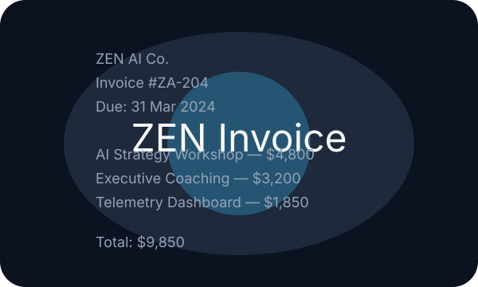

# ZEN Vanguard · Module 2 · Section 2

Production-ready Next.js 14 + TypeScript experience for the ZEN Vanguard Executive AI Pioneer Program. Operate streaming labs, manage encrypted API keys, and earn badges while mastering telemetry-first AI operations.

## Quick start

```bash
npm install
npm run dev
```

1. Launch the app and open **Settings** (`g` + `s`).
2. Paste your provider key (OpenAI today; Anthropic, Google, Mistral ready when available). Keys are encrypted client-side with AES-GCM + PBKDF2 and never leave your browser.
3. Choose a default model profile and optional telemetry opt-in.
4. Visit the **Lab** index (`g` + `l`), pick a module, and complete your first challenge.



## Labs

Each lab delivers a teach-then-test mission with telemetry, cost awareness, and challenge scoring.

- **Agent Forge** – assemble agents with routing, tools, and reasoning traces.
- **Toolsmith** – author JSON schemas, validate tool calls, hit ATS conversion challenge.
- **Workflow Canvas** – design multi-step flows with latency playback and BPMN export.
- **Prompt-Ops** – run prompt A/B tests, track cost deltas, auto-optimize variants.
- **Vision Studio** – upload screenshots, define region prompts, extract structured JSON.
- **Data Broker** – ingest docs, retrieve top chunks, answer with citations and accuracy guards.

## Key features

- **Security first** – Web Crypto AES-GCM storage (`zen.secure.kv`), PBKDF2 rotation, proxy disabled unless server secret configured.
- **Telemetry** – per-run metrics, cost estimator (`lib/utils/cost.ts`), JSON/Markdown exports.
- **Gamification** – XP, badges (`lib/gamify/badges.ts`), quest tree (`lib/gamify/quests.ts`), badge wall export.
- **Challenge scoring** – `/api/score` routes to rubric engine (`lib/scoring/challenges.ts`).
- **Accessibility + polish** – glass aesthetic, keyboard shortcuts, focus states, prefers-reduced-motion support.

## Scripts

- `npm run dev` – start Next.js in development.
- `npm run build` – build production bundle.
- `npm run lint` – run ESLint.
- `npm run format` – format with Prettier.
- `npm run typecheck` – TypeScript project check.

## Troubleshooting

- **403 when running `npm install`** – This environment occasionally blocks requests to the public npm registry. Retry in a different network or mirror, or configure an authenticated proxy before installing dependencies.

## Testing checklist

- App loads without API keys; labs gated via KeyGuard with clear CTA.
- Settings encrypt/decrypt keys locally (inspect `localStorage` for ciphertext only).
- Agent Forge streams responses, logs tokens/latency/cost.
- Prompt-Ops runs A/B and shows deltas.
- Vision Studio extracts seeded invoice JSON.
- Data Broker ingests sample docs, retrieves top chunks, cites sources.
- Completing challenges grants XP + badges; BadgeWall export produces PNG.

## Contributing

1. Fork and clone.
2. Install dependencies with `npm install`.
3. Use feature branches and conventional commits.
4. Keep telemetry safe—no API keys in logs or commits.

## License

© 2024 ZEN AI Co. All rights reserved.
